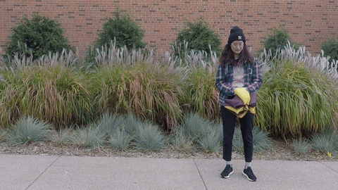
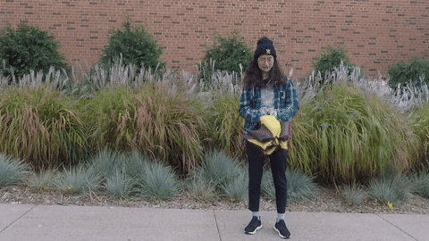
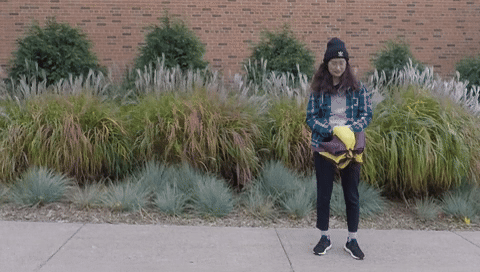
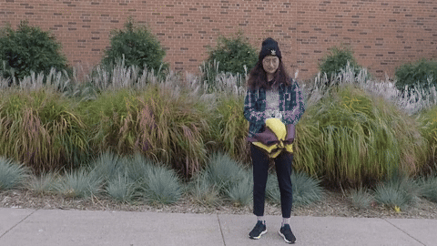

# Decoupling Dynamic Monocular Videos for Dynamic View Synthesis (TVCG 2024)
[Paper](https://arxiv.org/abs/2304.01716) 

## Demo
        
 
 Left to right: input video, fix time and synthesize from novel viewpoints, fix viewpoint and synthesize from novel timestamps, synthesize from both novel viewpoints and timestamps. Please find more results in [Demo](https://youtu.be/cCZRRpOd8F8).


## Getting Started

### Dependencies

* Linux
* Anaconda 3
* Python 3.8
* CUDA 11.1
* RTX 3090

### Installation


```
git clone https://github.com/mengyou2/DecoulpingNeRF.git
cd DecoulpingNeRF
conda create -n denerf python=3.8
conda activate denerf
pip install -r requirements.txt
```

### Training

To train the model by running
```
python run_nerf.py --config ./configs/config_xxxx.txt 
```

### Testing

To train the model by running
```
python run_nerf.py --config ./configs/config_xxxx.txt --render_only --ft_path ./logs/xxxx/200000.tar
```
## Acknowledgments
Our code is build upon [NeRF](https://github.com/bmild/nerf), [NeRF-pytorch](https://github.com/yenchenlin/nerf-pytorch), [NSFF](https://github.com/zhengqili/Neural-Scene-Flow-Fields) and [DynamicNeRF](https://github.com/gaochen315/DynamicNeRF).

## Citation
```
@article{you2024decoupling,
  title={Decoupling dynamic monocular videos for dynamic view synthesis},
  author={You, Meng and Hou, Junhui},
  journal={IEEE Transactions on Visualization and Computer Graphics},
  year={2024},
  publisher={IEEE}
}
```


